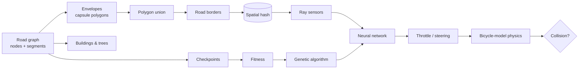

# NeuroDrive

A self-driving car simulator in plain JavaScript. You draw the roads, and a population of small neural networks learns to drive them through neuro-evolution.

Live: https://aristxa.github.io/neurodrive/

There are three modes:

- Build: draw a road graph. Lanes, borders, crosswalks, buildings and trees are generated from it.
- Train: 150+ cars with ray-cast sensors evolve with a genetic algorithm. You can watch the leader's network, the fitness chart and its planned path.
- Drive: drive through traffic yourself, and press `P` to hand the wheel to the best trained brain.

No frameworks, ML libraries or build step. It also works on phones (touch pedals and steering, pinch zoom, a tap-based road editor).

## Running it

Open `index.html` in a browser, or serve the folder:

```bash
npm start          # http://localhost:8080
npm run train      # headless training in Node, writes js/data/pretrained.js
```

Press `H` in the app for the keyboard shortcuts.

## How it works



### World (`js/world`)

Each road segment is turned into a capsule-shaped polygon ("envelope"). The union of all envelopes gives the road borders, which is what the cars sense and crash into. Buildings are placed along a wider set of envelopes and filtered for overlaps; trees are rejection-sampled around them. Both are drawn with a simple pseudo-3D projection. Generation is seeded, so the same graph always gives the same city.

### Cars (`js/sim`)

The cars use a kinematic bicycle model (yaw rate = v / wheelbase · tan(δ)) with a grip limit, so they can't take sharp turns at full speed. Each car has 9 ray sensors over a 153° arc. Traffic cars wander the graph in the right-hand lane with a pure-pursuit controller, slowing for corners and keeping a gap to the car in front.

### Learning (`js/ai`)

- Network: `10 → 12 → 8 → 2` with tanh (254 parameters). Inputs are the 9 sensors plus speed; outputs are throttle and steering.
- Fitness counts unique checkpoints reached, with a small distance tie-breaker and a crash penalty. Driving in circles earns nothing, and a car that makes no progress for 3.5 s is removed.
- The GA keeps the top 4%, uses tournament selection, crossover at the neuron level (a neuron's bias and incoming weights stay together) and gaussian mutation.
- Every generation gets the same seeded traffic so scores are comparable. "Vary traffic" turns that off for more robust brains.

### Performance

Border segments and checkpoints sit in a uniform spatial hash, so each car only checks nearby geometry. Ray casting and collision work on typed arrays without allocating. The sim runs on a fixed 60 Hz step with a CPU budget per frame, which lets training run up to 30× real time without falling behind. The engine doesn't touch the DOM, so `tools/train.js` runs the same code in Node: 200 cars for 80 generations takes 2–3 minutes.

## Layout

```
index.html            app shell
css/style.css         UI
js/core/              math, geometry (union, envelopes), spatial hash, graph, theme
js/world/             world generator, buildings & trees, preset worlds
js/ai/                neural network, genetic algorithm
js/sim/               sensors, car physics, traffic, training loop
js/render/            camera, network view, fitness chart, minimap
js/editor/            road editor (undo, junction splitting, start placement)
js/ui/storage.js      saving + JSON import/export
js/app.js             modes, input, render loop, panels
js/data/pretrained.js brains trained by tools/train.js
tools/train.js        headless trainer (Node)
```

## Next

- Route planning (A* on the road graph) with a destination to reach
- Traffic lights and right-of-way at junctions
- Training in a Web Worker
- Try PPO or CMA-ES instead of the GA and compare the learning curves
