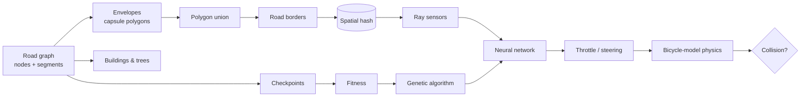

# NeuroDrive — autonomous driving lab

**Build a city. Then watch a population of neural networks teach themselves to drive it.**

NeuroDrive is a self-driving car simulator written from scratch in vanilla JavaScript, with no frameworks, no ML libraries and no build step. You draw a road network, and the engine turns it into a drivable 3D-ish city. Hundreds of cars, each controlled by its own small neural network, then learn to drive through neuro-evolution. When a network is good enough, you can take it for a test drive and hand it the wheel.

| Build | Train | Drive |
|---|---|---|
| Draw roads with a graph editor. Lanes, borders, crosswalks, buildings and trees are generated procedurally. | 150+ AI cars with ray-cast sensors evolve through a genetic algorithm. Live network, fitness chart, planned trajectory. | Drive yourself through traffic, then press **P** to engage autopilot with the best trained brain. |

## Quick start

```bash
# option 1: just open index.html in a browser (no server needed)

# option 2: serve it
npm start            # http://localhost:8080

# train brains headlessly at full CPU speed (writes js/data/pretrained.js)
npm run train
```

Press **H** in the app for all shortcuts.

## How it works



### World generation (`js/world`)
- Every road segment becomes an **envelope**, a capsule polygon of road width.
- A **polygon union** (split all intersecting edges, keep the pieces outside every other polygon) produces the road borders that cars collide with and sense.
- **Buildings** are placed along the union of wider "guide" envelopes, then filtered for overlaps. **Trees** are rejection-sampled near roads and buildings. Both are drawn with a pseudo-3D projection relative to the camera.
- Generation is seeded, so the same graph always produces the same city.

### Car and sensors (`js/sim`)
- **Kinematic bicycle model**: yaw rate = v / wheelbase · tan(δ), capped by a lateral-grip limit so cars can't turn unrealistically at speed.
- **9 ray-cast sensors** over a 153° arc report proximity to road borders and traffic.
- **Traffic** random-walks the road graph in the right-hand lane using a pure-pursuit controller. It brakes for corners and keeps its distance from the car ahead.

### Learning (`js/ai`)
- **Network**: `10 → 12 → 8 → 2`, tanh activations (254 parameters). Inputs are 9 sensor readings plus speed. Outputs are continuous throttle and steering.
- **Fitness**: the number of *unique* road checkpoints reached, plus a small distance tie-breaker, minus a crash penalty. Circling or wiggling in place earns nothing. Cars that stop making progress for 3.5 s are retired.
- **Genetic algorithm**: elitism (top 4%), tournament selection, **neuron-level crossover** (a neuron's bias and incoming weights are inherited together, which preserves learned features), and gaussian mutation.
- **Fair comparison**: every generation faces the same seeded traffic scenario, unless "vary traffic" is on (use it for robustness).

### Performance
- A **uniform spatial hash** over border segments and checkpoints means each car only tests the geometry near it, instead of all of it.
- Hot paths (ray casting, collision) are allocation-free and work on flat typed arrays.
- A **fixed 60 Hz timestep** with an accumulator and CPU budget runs up to 30× real time without the "spiral of death" (falling further behind every frame).
- The engine is DOM-free, so `tools/train.js` runs the exact same code in Node. Training 200 cars for 80 generations takes about 2–3 minutes.

## Project structure

```
index.html            app shell
css/style.css         UI
js/core/              math, geometry (union, envelopes), spatial hash, graph, theme
js/world/             world generator, buildings & trees, preset worlds
js/ai/                neural network, genetic algorithm
js/sim/               sensors, car physics, traffic, training loop
js/render/            camera, network visualizer, fitness chart, minimap
js/editor/            road graph editor (undo, junction splitting, start placement)
js/ui/storage.js      persistence + JSON import/export
js/app.js             modes, input, render loop, panels
js/data/pretrained.js brains trained by tools/train.js
tools/train.js        headless trainer (Node)
```

## Ideas for next steps
- Route planning (A* on the road graph) with a "go to destination" objective
- Traffic lights and right-of-way at intersections
- Web Worker training so evolution runs off the main thread
- Replace the GA with PPO or CMA-ES and compare learning curves
